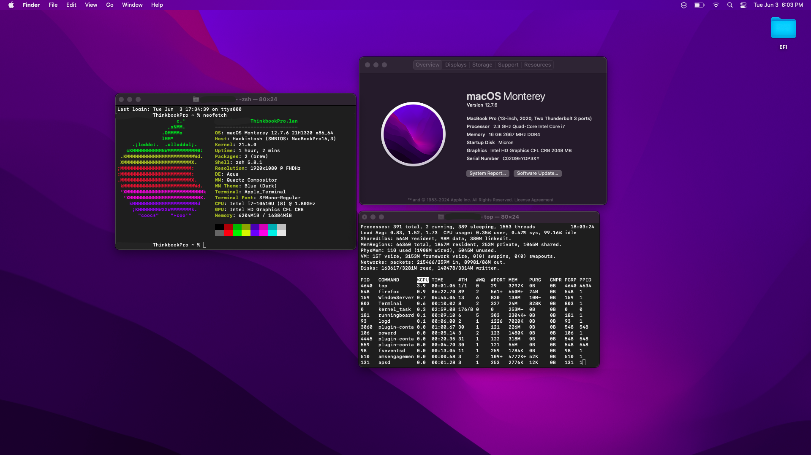
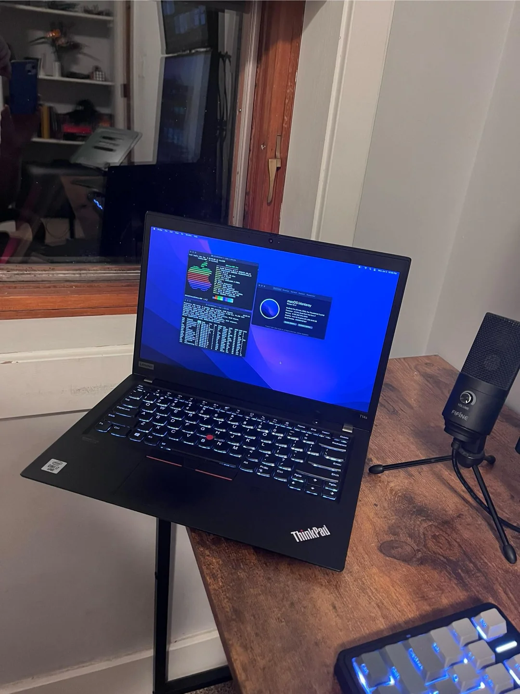

# 🍏 Lenovo ThinkPad T14s Gen 1 Hackintosh EFI (macOS Monterey 12.7.6)

This repository contains a fully working **OpenCore 1.0.4** EFI for the **Lenovo ThinkPad T14s Gen 1** with an Intel i7-10610U processor. It is tested and confirmed functional with **macOS Monterey 12.7.6**, with working iServices (iMessage, FaceTime, iCloud, etc.), proper GPU acceleration, battery management, and more.

---

## 💻 System Configuration

| Component       | Detail                          |
|----------------|----------------------------------|
| Model           | Lenovo ThinkPad T14s Gen 1       |
| CPU             | Intel Core i7-10610U (Comet Lake)|
| GPU             | Intel UHD Graphics 620           |
| Audio           | Realtek ALC257                   |
| Storage         | NVMe SSD                         |
| Trackpad        | PS2 Trackpad + TrackPoint        |
| SMBIOS          | MacBookPro16,3                   |
| Bootloader      | OpenCore 1.0.4                   |
| macOS Version   | Monterey 12.7.6                         |

---

## ✅ Working Features

| Feature               | Status        |
|-----------------------|---------------|
| Boot into macOS       | ✅ Working     |
| Intel UHD Graphics    | ✅ Full QE/CI  |
| Internal Display      | ✅ Working     |
| HDMI Output           | ✅ Working     |
| Trackpad              | ✅ Fully Functional |
| TrackPoint + Buttons  | ✅ Working     |
| Audio Output          | ✅ Working (`layout-id=11`) |
| Battery Indicator     | ✅ Working     |
| Sleep/Wake            | ✅ Stable      |
| USB Ports             | ✅ Working (USBMap) |
| iServices (iCloud, iMessage, FaceTime) | ✅ Fully Functional |

---

## ❌ Non-Working / Untested

| Feature              | Status        |
|----------------------|---------------|
| Bluetooth            | ❌ Not Working |
| Fingerprint Sensor   | ❌ Not Working |
| Microphone           | ❌ Not Working |
| Webcam               | ❌ Not Working |
| MicroSD Slot         | ❌ Not Working |

---

## 🧠 Device Properties (Injected via config.plist)

| PCI Path                         | Injected Properties                                       |
|----------------------------------|------------------------------------------------------------|
| `PciRoot(0x0)/Pci(0x2,0x0)`     | `AAPL,ig-platform-id = 00009B3E`<br>`device-id = 9B3E0000`<br>Framebuffer patches for graphics |
| `PciRoot(0x0)/Pci(0x1f,0x3)`    | `layout-id = 11 (0B 00 00 00)` (for Realtek ALC257 audio) |

---

## 🧰 Boot Args

```
keepsyms=1 -igfxfw=2
```

These ensure proper debugging and iGPU framebuffer firmware loading.

---

## 📦 Kexts Included

| Kext Name              | Purpose                      |
|------------------------|------------------------------|
| `Lilu.kext`            | Core patching framework      |
| `WhateverGreen.kext`   | Graphics injection + framebuffer |
| `AppleALC.kext`        | Audio patching for ALC257    |
| `VirtualSMC.kext`      | Emulates Apple SMC            |
| `SMCBatteryManager.kext` | Battery status reporting    |
| `VoodooPS2Controller.kext` | Trackpad, keyboard, TrackPoint |

---

## 🔐 OpenCore Configuration Highlights

| Setting              | Value       |
|----------------------|-------------|
| OpenCore Version     | 1.0.4       |
| SecureBootModel      | `Default`   |
| SMBIOS Spoof         | `MacBookPro16,3` |
| NVRAM Boot-Args      | `keepsyms=1 -igfxfw=2` |
| RebuildAppleMemoryMap| ✅ Enabled  |
| SetupVirtualMap      | ✅ Enabled  |
| DevirtualiseMmio     | ✅ Enabled  |
| ProtectUefiServices  | ✅ Enabled  |

---

## 📁 EFI Folder Structure

```
EFI/
├── BOOT/
│   └── BOOTx64.efi
└── OC/
    ├── ACPI/
    ├── Drivers/
    ├── Kexts/
    ├── Tools/
    └── config.plist
```

---

## 🔧 Post-Install Notes

- This EFI is tailored for **macOS Monterey 12.7.6**. It may work on later versions (Sonoma, Sequoia), but is **untested**.
- Before using iServices, make sure to generate your own serial numbers using [GenSMBIOS](https://github.com/corpnewt/GenSMBIOS)
- Keep a backup of your current EFI on a USB in case a macOS update causes a boot issue.
- You can reset NVRAM in the OpenCore boot picker by pressing the spacebar and selecting **Reset NVRAM**.

---

## 📸 Screenshots

### Desktop


### The Machine


---

## 🙏 Credits

- [Dortania OpenCore Install Guide](https://dortania.github.io/OpenCore-Install-Guide/)
- [Acidanthera GitHub](https://github.com/acidanthera)
- [Hackintosh community on Reddit and InsanelyMac](https://reddit.com/r/hackintosh)
- Everyone keeping legacy ThinkPads alive 🍻

---

Feel free to fork, tweak, and use!
